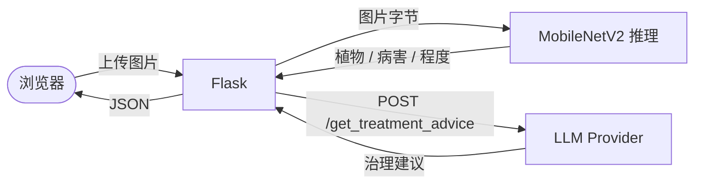

# 植物病害识别（MobileNetV2 + LLM）

基于 [百度 2018 AI 植物病害竞赛数据集](https://challenger.ai/competition/pdr2018) 训练 MobileNetV2 多分类模型，结合大语言模型（OpenAI / 百度文心 / 阿里通义）生成针对性治理建议。

## 架构



## 三个入口脚本

项目根目录下有三个入口脚本，对应三个使用阶段。**按顺序运行即可**：

| 脚本 | 作用 | 何时跑 |
|---|---|---|
| `prepare_dataset.py` | 把扁平的百度数据集归类成 `ImageFolder` 结构，并清洗 | 拿到数据后第一步 |
| `train_model.py` | 训练 MobileNetV2，产出权重文件 | 数据准备好之后 |
| `run_web.py` | 启动 Flask Web 服务（上传图片 → 识别 → LLM 给建议） | 有了权重之后；或者只想看 Web 长啥样 |

每个脚本都可以直接 `python xxx.py` 跑，加 `--help` 看可选参数。

## 端到端流程

### 0. 准备环境（一次性）

```bash
git clone <your-repo>
cd plant-disease-detection
uv sync --all-extras            # 装依赖（含训练 + 开发工具）
cp .env.example .env            # 不填 key 也行，默认 LLM_PROVIDER=mock
```

### 1. 把数据集放到项目根目录

从 [百度 PDR2018](https://challenger.ai/competition/pdr2018) 下载并解压，确保**项目根目录下**有这两个文件夹（名字保持原样）：

```
plant-disease-detection/
├── AgriculturalDisease_trainingset/
│   ├── images/                                           # 31718 张 *.jpg
│   └── AgriculturalDisease_train_annotations.json
├── AgriculturalDisease_validationset/
│   ├── images/                                           # 4540 张 *.jpg
│   └── AgriculturalDisease_validation_annotations.json
├── prepare_dataset.py
├── train_model.py
└── run_web.py
```

### 2. 数据预处理

```bash
uv run python prepare_dataset.py
```

默认行为：① 复制图片到 `input/train/<class_id>/` 与 `input/val/<class_id>/`，② 自动清洗（去重 + 删除 train/val 重叠）。

可选参数：

```bash
uv run python prepare_dataset.py --no-clean   # 只归类，不清洗
uv run python prepare_dataset.py --move       # 用移动而非复制（节省磁盘但破坏性）
```

### 3. 训练

```bash
uv run python train_model.py
```

默认 20 epoch、batch_size 64、AdamW、lr 1e-4，用 `cuda` → `mps` → `cpu` 自动选设备。产物：

- `resources/mobilenetv2_best.pth` — 验证集最佳权重（直接给 `run_web.py` 用）
- `artifacts/loss.png` / `artifacts/accuracy.png` — 训练曲线

CPU/小显存常用调整：

```bash
uv run python train_model.py --epochs 5 --batch-size 16
```

### 4. 启动 Web

```bash
uv run python run_web.py
```

打开 [http://localhost:5000](http://localhost:5000) → 上传图片 → 点「获取治理建议」。

> 不想训练只想看页面长啥样？直接跳到第 4 步即可。无权重时 `/predict` 会返回 503，但首页 / 关于页 / `/get_treatment_advice` 都能正常用。

## HTTP 路由（`run_web.py`）

| 路由 | 方法 | 说明 |
|---|---|---|
| `/` | GET | 首页 |
| `/identify` | GET | 上传 + 识别页面 |
| `/nav` | GET | 关于页 |
| `/predict` | POST | `multipart/form-data`，字段 `image` |
| `/get_treatment_advice` | POST | JSON `{plant_class, disease_name, disease_degree, health_status, provider?}` |

默认绑定 `127.0.0.1:5000`，通过 `.env` 里的 `HOST` / `PORT` / `FLASK_DEBUG` 调整。

## LLM 配置

在 `.env` 文件里配置：

| Provider | 必需环境变量 |
|---|---|
| `mock` | 无（默认值；用于离线测试） |
| `openai` | `OPENAI_API_KEY` |
| `baidu` | `BAIDU_API_KEY`、`BAIDU_SECRET_KEY` |
| `alibaba`（推荐） | `DASHSCOPE_API_KEY` |

通过 `LLM_PROVIDER` 默认值选择，单次请求可在 body 里覆盖 `provider` 字段。

## 项目结构

```
plant-disease-detection/
├── prepare_dataset.py        # 入口①：数据归类 + 清洗
├── train_model.py            # 入口②：训练
├── run_web.py                # 入口③：Web 服务
├── pyproject.toml            # uv / 依赖 / 工具链
├── .env.example              # 环境变量样例
├── resources/
│   ├── actual_classed_v2.txt # 类别映射表
│   └── mobilenetv2_best.pth  # 训练后的权重（不入仓库）
├── src/plant_disease/        # 实现细节
│   ├── config.py             # Settings（统一读环境变量）
│   ├── errors.py             # 自定义异常
│   ├── model.py              # InferenceModel
│   ├── data/                 # class_map / dataset_classifier / data_clean
│   ├── llm/                  # base + mock / openai / baidu / alibaba + factory
│   ├── training/train.py     # 训练流程
│   └── web/
│       ├── app.py            # Flask app factory
│       ├── routes.py         # 路由
│       ├── templates/        # 前端 HTML
│       └── static/           # CSS / JS
└── tests/                    # pytest
```

## 开发

```bash
uv sync --all-extras
uv run pytest                # 跑全部测试（约 1 秒、47 项）
uv run ruff check .          # lint
uv run black .               # 格式化
```

## 常见问题

**Q：没有 `.pth` 权重怎么办？**
A：跳过步骤 2、3，直接跑 `run_web.py`。Web 能起来，识别接口会返回 503，但 LLM 建议接口（`mock` provider）能正常用。

**Q：为什么是 MobileNetV2 而不是仓库名所写的 V3？**
A：原仓库代码实际就是 V2，本次重构选择对齐到代码现状，避免误导。后续若升级 V3 是独立 PR。

**Q：Mac 没有 CUDA 能跑吗？**
A：能。设备自动选择 `cuda → mps → cpu`，训练和推理都适配。

**Q：CPU 训练巨慢怎么办？**
A：先用 `--epochs 1 --batch-size 16` 跑通流程；要真训练建议借 Colab/Kaggle 的免费 GPU。

## License

MIT
