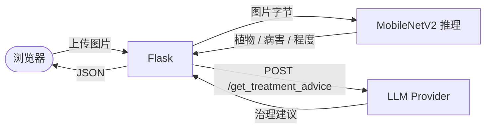

# 植物病害识别项目全面重构 · 实施计划

> **For agentic workers:** REQUIRED SUB-SKILL: Use superpowers:subagent-driven-development (recommended) or superpowers:executing-plans to implement this plan task-by-task. Steps use checkbox (`- [ ]`) syntax for tracking.

**Goal:** 将平铺、命名混乱、缺失模板、零测试的项目重构为 `src/plant_disease/` 包结构，由 uv 管理依赖，统一到 MobileNetV2，附带可启动的 Flask Web demo、单元测试与中文 README。

**Architecture:** 引入 `src/plant_disease/` 包结构，按职责分 `model / data / llm / training / web` 子包；`config.py` 集中读取环境变量；`cli.py` 作为 `serve` / `train` 入口；新增 `tests/` 用 pytest；`templates/` + `static/` 重做 Web 前端；删除 Tkinter `predict.py`。

**Tech Stack:** Python ≥ 3.10、uv、Flask、PyTorch、Torchvision、Pillow、Requests、python-dotenv、pytest、ruff、black。

**关联 Spec:** `docs/superpowers/specs/2026-05-26-plant-disease-refactor-design.md`

---

## 文件结构总览（任务结束后）

```
plant-disease-detection/
├── pyproject.toml
├── uv.lock
├── .python-version
├── .gitignore
├── .env.example
├── README.md
├── docs/superpowers/specs/2026-05-26-plant-disease-refactor-design.md
├── docs/superpowers/plans/2026-05-26-plant-disease-refactor.md
├── resources/actual_classed_v2.txt
├── src/plant_disease/
│   ├── __init__.py
│   ├── cli.py
│   ├── config.py
│   ├── errors.py
│   ├── model.py
│   ├── data/{__init__.py, class_map.py, dataset_classifier.py, data_clean.py}
│   ├── llm/{__init__.py, base.py, factory.py, mock_provider.py,
│   │        openai_provider.py, baidu_provider.py, alibaba_provider.py}
│   ├── training/{__init__.py, train.py}
│   └── web/{__init__.py, app.py, routes.py}
├── templates/{base.html, home.html, nav.html, index.html}
├── static/{css/style.css, js/identify.js}
└── tests/{conftest.py, test_class_map.py, test_config.py, test_errors.py,
          test_llm_base.py, test_llm_factory.py, test_llm_mock.py,
          test_inference_model.py, test_routes.py}
```

---

## Task 1：清理旧文件 + 初始化 uv 项目

**Files:**
- Delete: `predict.py`、`class_indices_61cls.json`（0 字节空文件）、`requirements.txt`
- Move: `actual_classed_v2.txt` → `resources/actual_classed_v2.txt`
- Create: `pyproject.toml`、`.python-version`、`.gitignore`、`.env.example`
- Create empty: `src/plant_disease/__init__.py`、`tests/__init__.py`

- [ ] **Step 1：用 uv 初始化项目骨架**

```bash
cd /Users/dww/Desktop/plant-diease-dectection-with-mobilenet_v3-and-LLM
uv init --package --name plant-disease --no-readme --vcs none
```

如果 `uv init` 报已存在文件，手工创建 `pyproject.toml`（见下一步）。

- [ ] **Step 2：写 `pyproject.toml`**

```toml
[project]
name = "plant-disease"
version = "0.1.0"
description = "Plant disease detection with MobileNetV2 and LLM-based treatment advice."
readme = "README.md"
requires-python = ">=3.10"
dependencies = [
    "flask>=2.2.0",
    "torch>=2.0.0",
    "torchvision>=0.15.0",
    "pillow>=9.0.0",
    "numpy>=1.21.0",
    "requests>=2.28.0",
    "python-dotenv>=1.0.0",
    "tqdm>=4.65.0",
]

[project.optional-dependencies]
train = [
    "matplotlib>=3.7.0",
    "scikit-learn>=1.2.0",
    "opencv-python>=4.7.0",
]
dev = [
    "pytest>=7.4.0",
    "ruff>=0.1.0",
    "black>=23.0.0",
]

[project.scripts]
plant-disease = "plant_disease.cli:main"

[build-system]
requires = ["hatchling"]
build-backend = "hatchling.build"

[tool.hatch.build.targets.wheel]
packages = ["src/plant_disease"]

[tool.ruff]
line-length = 100
target-version = "py310"

[tool.ruff.lint]
select = ["E", "F", "W", "I", "N", "UP", "B"]

[tool.black]
line-length = 100
target-version = ["py310"]

[tool.pytest.ini_options]
testpaths = ["tests"]
pythonpath = ["src"]
```

- [ ] **Step 3：写 `.python-version`**

```
3.11
```

- [ ] **Step 4：写 `.gitignore`**

```
# Python
__pycache__/
*.py[cod]
*$py.class
*.egg-info/
.pytest_cache/
.ruff_cache/

# Virtualenv / uv
.venv/
.uv/

# Env
.env

# Model weights and data (too large for repo)
*.pth
*.pt
input/
resources/*.pth

# OS
.DS_Store

# Editors
.vscode/
.idea/

# Outputs
*.png
!docs/**/*.png
```

- [ ] **Step 5：写 `.env.example`**

```
# LLM 提供商：mock | openai | baidu | alibaba
LLM_PROVIDER=mock

# 阿里通义（推荐）
DASHSCOPE_API_KEY=

# OpenAI
OPENAI_API_KEY=

# 百度文心
BAIDU_API_KEY=
BAIDU_SECRET_KEY=

# 推理资源
WEIGHTS_PATH=resources/mobilenetv2_best.pth
CLASSES_TXT=resources/actual_classed_v2.txt

# Flask
FLASK_DEBUG=0
PORT=5000

# 日志
PLANT_DISEASE_DEBUG=0
```

- [ ] **Step 6：移动类映射表 + 删除废弃文件**

```bash
mkdir -p resources
git mv actual_classed_v2.txt resources/actual_classed_v2.txt
git rm predict.py class_indices_61cls.json requirements.txt
```

- [ ] **Step 7：创建空包占位**

```bash
mkdir -p src/plant_disease/{data,llm,training,web} tests templates static/css static/js
touch src/plant_disease/__init__.py
touch src/plant_disease/data/__init__.py
touch src/plant_disease/llm/__init__.py
touch src/plant_disease/training/__init__.py
touch src/plant_disease/web/__init__.py
touch tests/__init__.py
```

`src/plant_disease/__init__.py` 写：

```python
"""Plant disease detection package."""

__version__ = "0.1.0"
```

- [ ] **Step 8：sync 依赖并验证**

```bash
uv sync --all-extras
uv run python -c "import plant_disease; print(plant_disease.__version__)"
```

Expected: `0.1.0`

- [ ] **Step 9：commit**

```bash
git add -A
git commit -m "chore: scaffold uv project, drop predict.py and stale files"
```

---

## Task 2：errors.py（自定义异常）

**Files:**
- Create: `src/plant_disease/errors.py`
- Test: `tests/test_errors.py`

- [ ] **Step 1：写测试 `tests/test_errors.py`**

```python
from plant_disease.errors import (
    PlantDiseaseError,
    InferenceError,
    LLMServiceError,
    LLMConfigError,
)


def test_hierarchy():
    assert issubclass(InferenceError, PlantDiseaseError)
    assert issubclass(LLMServiceError, PlantDiseaseError)
    assert issubclass(LLMConfigError, LLMServiceError)


def test_can_be_raised_with_message():
    err = LLMConfigError("missing key")
    assert str(err) == "missing key"
```

- [ ] **Step 2：运行测试，确认失败**

```bash
uv run pytest tests/test_errors.py -v
```

Expected: `ImportError: No module named 'plant_disease.errors'`

- [ ] **Step 3：实现 `src/plant_disease/errors.py`**

```python
"""Custom exception hierarchy for plant_disease."""


class PlantDiseaseError(Exception):
    """Base exception for all plant_disease errors."""


class InferenceError(PlantDiseaseError):
    """Raised when inference fails (weights load, forward pass, image decode)."""


class LLMServiceError(PlantDiseaseError):
    """Raised when an LLM provider call fails (network, timeout, HTTP error)."""


class LLMConfigError(LLMServiceError):
    """Raised when an LLM provider is missing required configuration."""
```

- [ ] **Step 4：测试通过**

```bash
uv run pytest tests/test_errors.py -v
```

Expected: 2 passed

- [ ] **Step 5：commit**

```bash
git add src/plant_disease/errors.py tests/test_errors.py
git commit -m "feat(errors): add custom exception hierarchy"
```

---

## Task 3：config.py（集中配置）

**Files:**
- Create: `src/plant_disease/config.py`
- Test: `tests/test_config.py`

- [ ] **Step 1：写测试 `tests/test_config.py`**

```python
from pathlib import Path

import pytest

from plant_disease.config import Settings, load_settings


def test_load_settings_defaults(monkeypatch):
    for key in [
        "LLM_PROVIDER",
        "DASHSCOPE_API_KEY",
        "OPENAI_API_KEY",
        "BAIDU_API_KEY",
        "BAIDU_SECRET_KEY",
        "WEIGHTS_PATH",
        "CLASSES_TXT",
        "FLASK_DEBUG",
        "PORT",
    ]:
        monkeypatch.delenv(key, raising=False)

    s = load_settings()
    assert isinstance(s, Settings)
    assert s.llm_provider == "mock"
    assert s.flask_debug is False
    assert s.port == 5000
    assert s.weights_path == Path("resources/mobilenetv2_best.pth")
    assert s.classes_txt == Path("resources/actual_classed_v2.txt")
    assert s.dashscope_api_key == ""


def test_load_settings_overrides(monkeypatch):
    monkeypatch.setenv("LLM_PROVIDER", "alibaba")
    monkeypatch.setenv("DASHSCOPE_API_KEY", "sk-xyz")
    monkeypatch.setenv("FLASK_DEBUG", "1")
    monkeypatch.setenv("PORT", "8080")
    monkeypatch.setenv("WEIGHTS_PATH", "/tmp/w.pth")

    s = load_settings()
    assert s.llm_provider == "alibaba"
    assert s.dashscope_api_key == "sk-xyz"
    assert s.flask_debug is True
    assert s.port == 8080
    assert s.weights_path == Path("/tmp/w.pth")


@pytest.mark.parametrize("value,expected", [("0", False), ("false", False), ("1", True), ("true", True), ("True", True)])
def test_flask_debug_parsing(monkeypatch, value, expected):
    monkeypatch.setenv("FLASK_DEBUG", value)
    assert load_settings().flask_debug is expected
```

- [ ] **Step 2：运行测试确认失败**

```bash
uv run pytest tests/test_config.py -v
```

Expected: ImportError

- [ ] **Step 3：实现 `src/plant_disease/config.py`**

```python
"""Centralized environment-driven settings.

This is the only module (besides cli.py and training argparse) that reads os.environ.
"""

from __future__ import annotations

import os
from dataclasses import dataclass
from pathlib import Path

_TRUTHY = {"1", "true", "yes", "on"}


def _bool_env(name: str, default: bool = False) -> bool:
    raw = os.environ.get(name)
    if raw is None:
        return default
    return raw.strip().lower() in _TRUTHY


@dataclass(frozen=True)
class Settings:
    weights_path: Path
    classes_txt: Path
    llm_provider: str
    dashscope_api_key: str = ""
    openai_api_key: str = ""
    baidu_api_key: str = ""
    baidu_secret_key: str = ""
    flask_debug: bool = False
    port: int = 5000


def load_settings() -> Settings:
    return Settings(
        weights_path=Path(os.environ.get("WEIGHTS_PATH", "resources/mobilenetv2_best.pth")),
        classes_txt=Path(os.environ.get("CLASSES_TXT", "resources/actual_classed_v2.txt")),
        llm_provider=os.environ.get("LLM_PROVIDER", "mock").strip().lower(),
        dashscope_api_key=os.environ.get("DASHSCOPE_API_KEY", ""),
        openai_api_key=os.environ.get("OPENAI_API_KEY", ""),
        baidu_api_key=os.environ.get("BAIDU_API_KEY", ""),
        baidu_secret_key=os.environ.get("BAIDU_SECRET_KEY", ""),
        flask_debug=_bool_env("FLASK_DEBUG", False),
        port=int(os.environ.get("PORT", "5000")),
    )
```

- [ ] **Step 4：测试通过**

```bash
uv run pytest tests/test_config.py -v
```

Expected: 7 passed

- [ ] **Step 5：commit**

```bash
git add src/plant_disease/config.py tests/test_config.py
git commit -m "feat(config): centralize env-driven Settings"
```

---

## Task 4：data/class_map.py（替代 read_txt.py）

**Files:**
- Create: `src/plant_disease/data/class_map.py`
- Test: `tests/test_class_map.py`
- Delete: `read_txt.py`（旧版本）

- [ ] **Step 1：写测试 `tests/test_class_map.py`**

```python
from pathlib import Path

import pytest

from plant_disease.data.class_map import (
    CLASS_DICTS,
    ClassInfo,
    load_class_map,
    lookup_class,
)


def _write_txt(tmp_path: Path, content: str) -> Path:
    p = tmp_path / "classes.txt"
    p.write_text(content, encoding="utf-8")
    return p


def test_load_class_map_basic(tmp_path):
    p = _write_txt(tmp_path, "0 0 0 0 0\n1 0 1 1 1\n")
    rows = load_class_map(p)
    assert len(rows) == 2
    assert rows[0] == ClassInfo(plant="苹果", health_status="未患病", disease_degree="健康", disease_name="健康")
    assert rows[1].plant == "苹果"
    assert rows[1].disease_name == "苹果黑星病"


def test_load_class_map_missing_file(tmp_path):
    rows = load_class_map(tmp_path / "nope.txt")
    assert rows == []


def test_load_class_map_skips_malformed_rows(tmp_path):
    p = _write_txt(tmp_path, "0 0 0 0 0\nnot a row\n1 0 1 1 1\n")
    rows = load_class_map(p)
    assert len(rows) == 2


def test_load_class_map_utf8(tmp_path):
    p = _write_txt(tmp_path, "0 0 0 0 0\n")
    rows = load_class_map(p)
    assert "苹果" in rows[0].plant


def test_lookup_class_in_range():
    info = lookup_class([ClassInfo("a", "b", "c", "d")], 0)
    assert info.plant == "a"


def test_lookup_class_out_of_range_returns_placeholder():
    info = lookup_class([], 5)
    assert info.plant == "类别5"
    assert info.health_status == "未知"


def test_class_dicts_have_expected_keys():
    assert CLASS_DICTS["plant"][0] == "苹果"
    assert CLASS_DICTS["healthy"][0] == "未患病"
    assert CLASS_DICTS["degree"][0] == "健康"
    assert CLASS_DICTS["disease"][0] == "健康"
```

- [ ] **Step 2：运行测试确认失败**

```bash
uv run pytest tests/test_class_map.py -v
```

Expected: ImportError

- [ ] **Step 3：实现 `src/plant_disease/data/class_map.py`**

```python
"""Class index → human-readable mapping for the 61-class taxonomy."""

from __future__ import annotations

import logging
from dataclasses import dataclass
from pathlib import Path

logger = logging.getLogger(__name__)

PLANT_CLASS = {
    0: "苹果", 1: "樱桃", 2: "玉米", 3: "葡萄", 4: "柑桔",
    5: "桃", 6: "辣椒", 7: "马铃薯", 8: "草莓", 9: "番茄",
}
HEALTHY = {0: "未患病", 1: "患病"}
DISEASED_DEGREE = {0: "健康", 1: "一般", 2: "严重", 3: "患病但不分程度"}
DISEASED_CLASS = {
    0: "健康", 1: "苹果黑星病", 2: "苹果灰斑病", 3: "苹果雪松锈病",
    4: "樱桃白粉病", 5: "玉米灰斑病", 6: "玉米锈病", 7: "玉米叶斑病",
    8: "玉米花叶病毒病", 9: "葡萄黑腐病", 10: "葡萄轮斑病", 11: "葡萄褐斑病",
    12: "柑桔黄龙病", 13: "桃疮痂病", 14: "辣椒疮痂病",
    15: "马铃薯早疫病", 16: "马铃薯晚疫病", 17: "草莓叶枯病",
    18: "番茄白粉病", 19: "番茄疮痂病", 20: "番茄早疫病",
    21: "番茄晚疫病", 22: "番茄叶霉病", 23: "番茄斑点病",
    24: "番茄斑枯病", 25: "番茄红蜘蛛损伤", 26: "番茄黄化曲叶霉病",
    27: "番茄花叶病毒病",
}

CLASS_DICTS = {
    "plant": PLANT_CLASS,
    "healthy": HEALTHY,
    "degree": DISEASED_DEGREE,
    "disease": DISEASED_CLASS,
}


@dataclass(frozen=True)
class ClassInfo:
    plant: str
    health_status: str
    disease_degree: str
    disease_name: str


def load_class_map(path: Path) -> list[ClassInfo]:
    """Parse the 61-class mapping table.

    Each line: <class_id> <plant_idx> <healthy_idx> <degree_idx> <disease_idx>.
    Returns rows ordered by class_id; malformed/missing rows are skipped.
    Returns empty list when path doesn't exist.
    """
    if not path.exists():
        logger.warning("class map not found: %s", path)
        return []

    rows: list[ClassInfo] = []
    with path.open("r", encoding="utf-8") as f:
        for line in f:
            parts = line.strip().split()
            if len(parts) < 5:
                continue
            try:
                idx = [int(x) for x in parts[:5]]
            except ValueError:
                continue
            _, plant_i, healthy_i, degree_i, disease_i = idx
            rows.append(
                ClassInfo(
                    plant=PLANT_CLASS.get(plant_i, f"未知植物{plant_i}"),
                    health_status=HEALTHY.get(healthy_i, "未知"),
                    disease_degree=DISEASED_DEGREE.get(degree_i, "未知"),
                    disease_name=DISEASED_CLASS.get(disease_i, "未知"),
                )
            )
    return rows


def lookup_class(rows: list[ClassInfo], idx: int) -> ClassInfo:
    """Return ClassInfo for a class index, or a placeholder if out of range."""
    if 0 <= idx < len(rows):
        return rows[idx]
    return ClassInfo(plant=f"类别{idx}", health_status="未知", disease_degree="未知", disease_name="未知")
```

- [ ] **Step 4：测试通过**

```bash
uv run pytest tests/test_class_map.py -v
```

Expected: 7 passed

- [ ] **Step 5：删除旧 `read_txt.py`**

```bash
git rm read_txt.py
```

- [ ] **Step 6：commit**

```bash
git add src/plant_disease/data/class_map.py tests/test_class_map.py
git commit -m "feat(data): replace read_txt.py with utf-8-safe class_map module"
```

---

## Task 5：搬迁 dataset_classifier.py 与 data_clean.py

**Files:**
- Create: `src/plant_disease/data/dataset_classifier.py`、`src/plant_disease/data/data_clean.py`
- Delete: 根目录 `dataset_classifier.py`、`data_clean.py`

这两个脚本是数据预处理工具，本次重构不重写其核心逻辑（无数据可验证），只搬位置 + 加 logging + 加 `encoding="utf-8"` + 移除模块顶层副作用代码。

- [ ] **Step 1：搬迁 `dataset_classifier.py`**

```bash
git mv dataset_classifier.py src/plant_disease/data/dataset_classifier.py
```

修改 `src/plant_disease/data/dataset_classifier.py` 整文件为：

```python
"""Classify raw competition images into per-class subdirectories using JSON annotations."""

from __future__ import annotations

import json
import logging
import os
import shutil

from tqdm import tqdm

logger = logging.getLogger(__name__)


class ClassifyAsLabel:
    @staticmethod
    def read_json(json_path: str) -> list[dict]:
        with open(json_path, "r", encoding="utf-8") as f:
            data = json.loads(f.read())
        logger.info("loaded %d annotations from %s", len(data), json_path)
        return data

    def classify(self, img_path: str, json_path: str, out_path: str) -> None:
        """Move each image into out_path/<disease_class>/."""
        annotations = self.read_json(json_path)
        os.makedirs(out_path, exist_ok=True)

        for info in tqdm(annotations, desc="classifying"):
            name = info["image_id"]
            label = info["disease_class"]
            src = os.path.join(img_path, name)
            dst_dir = os.path.join(out_path, str(label))
            os.makedirs(dst_dir, exist_ok=True)
            if os.path.exists(src):
                shutil.move(src, dst_dir)
            else:
                logger.warning("missing source image: %s", src)
```

- [ ] **Step 2：搬迁 `data_clean.py`**

```bash
git mv data_clean.py src/plant_disease/data/data_clean.py
```

修改 `src/plant_disease/data/data_clean.py`：把模块顶部 `# coding=utf-8` 注释保留，把所有 `print` 改 `logger.info`/`warning`，所有 `open()` 加 `encoding="utf-8"`，把模块底部 `if __name__ == "__main__":` 改为：

```python
if __name__ == "__main__":
    import argparse
    parser = argparse.ArgumentParser()
    parser.add_argument("--train", required=True)
    parser.add_argument("--val", required=True)
    args = parser.parse_args()
    process_repeat(args.train, args.val)
```

最顶部加：

```python
import logging
logger = logging.getLogger(__name__)
```

并把 `print(...)` 全部替换为 `logger.info(...)`。

- [ ] **Step 3：验证可以 import**

```bash
uv run python -c "from plant_disease.data import dataset_classifier, data_clean; print('ok')"
```

Expected: `ok`

- [ ] **Step 4：commit**

```bash
git add -A
git commit -m "refactor(data): move data scripts under package, use logging + utf-8"
```

---

## Task 6：model.py（推理类，仅 V2、设备自动检测）

**Files:**
- Create: `src/plant_disease/model.py`
- Test: `tests/test_inference_model.py`
- Delete: 根目录旧 `model.py`

- [ ] **Step 1：写测试 `tests/test_inference_model.py`**

```python
from io import BytesIO
from pathlib import Path

import pytest
import torch
from PIL import Image

from plant_disease import errors
from plant_disease.data.class_map import ClassInfo
from plant_disease.model import InferenceModel, _select_device


def _png_bytes() -> bytes:
    img = Image.new("RGB", (256, 256), color=(120, 200, 80))
    buf = BytesIO()
    img.save(buf, format="PNG")
    return buf.getvalue()


@pytest.fixture
def patched_model(monkeypatch, tmp_path):
    """Construct InferenceModel without real weights or class file."""
    monkeypatch.setattr(InferenceModel, "_load_weights", lambda self, p: None)
    monkeypatch.setattr(
        "plant_disease.model.load_class_map",
        lambda _p: [ClassInfo("番茄", "患病", "一般", "番茄早疫病")],
    )
    return InferenceModel(weights_path=tmp_path / "fake.pth", classes_txt=tmp_path / "fake.txt")


def test_predict_returns_expected_keys(patched_model):
    out = patched_model.predict(_png_bytes())
    assert set(out.keys()) == {
        "class_id", "probability",
        "plant_class", "health_status",
        "disease_name", "disease_degree",
    }
    assert isinstance(out["class_id"], int)
    assert 0.0 <= out["probability"] <= 1.0


def test_predict_uses_class_map_fallback_when_idx_out_of_range(patched_model):
    out = patched_model.predict(_png_bytes())
    # mapping has 1 entry but the model has 61 outputs; if argmax > 0
    # we still must return a placeholder rather than crash.
    assert isinstance(out["plant_class"], str) and out["plant_class"]


def test_predict_invalid_image_raises_inference_error(patched_model):
    with pytest.raises(errors.InferenceError):
        patched_model.predict(b"not an image")


def test_select_device_cpu_when_no_cuda_no_mps(monkeypatch):
    monkeypatch.setattr(torch.cuda, "is_available", lambda: False)
    monkeypatch.setattr(torch.backends.mps, "is_available", lambda: False, raising=False)
    assert _select_device().type == "cpu"


def test_load_class_info_falls_back_when_file_missing(monkeypatch, tmp_path):
    monkeypatch.setattr(InferenceModel, "_load_weights", lambda self, p: None)
    m = InferenceModel(weights_path=tmp_path / "fake.pth", classes_txt=tmp_path / "missing.txt")
    assert m.class_info == []


def test_missing_weights_path_raises_inference_error(tmp_path, monkeypatch):
    monkeypatch.setattr(
        "plant_disease.model.load_class_map",
        lambda _p: [],
    )
    with pytest.raises(errors.InferenceError):
        InferenceModel(weights_path=tmp_path / "does-not-exist.pth", classes_txt=tmp_path / "classes.txt")
```

- [ ] **Step 2：运行测试确认失败**

```bash
uv run pytest tests/test_inference_model.py -v
```

Expected: ImportError

- [ ] **Step 3：实现 `src/plant_disease/model.py`**

```python
"""MobileNetV2-based inference model."""

from __future__ import annotations

import logging
from io import BytesIO
from pathlib import Path

import torch
from PIL import Image, UnidentifiedImageError
from torch import nn
from torchvision import models, transforms

from plant_disease.data.class_map import ClassInfo, load_class_map, lookup_class
from plant_disease.errors import InferenceError

logger = logging.getLogger(__name__)

NUM_CLASSES = 61
IMG_SIZE = 224


def _select_device() -> torch.device:
    if torch.cuda.is_available():
        return torch.device("cuda:0")
    if getattr(torch.backends, "mps", None) and torch.backends.mps.is_available():
        return torch.device("mps")
    return torch.device("cpu")


class InferenceModel:
    """Loads MobileNetV2 weights once and serves predictions."""

    def __init__(
        self,
        weights_path: Path,
        classes_txt: Path,
        num_classes: int = NUM_CLASSES,
    ) -> None:
        self.device = _select_device()
        logger.info("inference device: %s", self.device)

        self.transform = transforms.Compose(
            [
                transforms.Resize((IMG_SIZE, IMG_SIZE)),
                transforms.CenterCrop(IMG_SIZE),
                transforms.ToTensor(),
                transforms.Normalize(mean=[0.485, 0.456, 0.406], std=[0.229, 0.224, 0.225]),
            ]
        )

        self.class_info: list[ClassInfo] = load_class_map(classes_txt)
        self.num_classes = num_classes

        self.model = self._build_model(num_classes)
        self._load_weights(weights_path)
        self.model.to(self.device)
        self.model.eval()

    def _build_model(self, num_classes: int) -> nn.Module:
        model = models.mobilenet_v2()
        model.classifier[1] = nn.Sequential(
            nn.Dropout(0.3),
            nn.Linear(model.last_channel, num_classes),
        )
        return model

    def _load_weights(self, weights_path: Path) -> None:
        if not weights_path.exists():
            raise InferenceError(f"权重文件未找到：{weights_path}")
        try:
            state_dict = torch.load(weights_path, map_location=self.device, weights_only=True)
        except TypeError:
            state_dict = torch.load(weights_path, map_location=self.device)
        missing, unexpected = self.model.load_state_dict(state_dict, strict=False)
        if missing or unexpected:
            logger.info(
                "weights partial match: missing=%d, unexpected=%d", len(missing), len(unexpected)
            )

    def _prepare_image(self, file_bytes: bytes) -> torch.Tensor:
        try:
            img = Image.open(BytesIO(file_bytes)).convert("RGB")
        except (UnidentifiedImageError, OSError) as exc:
            raise InferenceError(f"无法解码图片：{exc}") from exc
        return torch.unsqueeze(self.transform(img), dim=0)

    def predict(self, file_bytes: bytes) -> dict:
        tensor = self._prepare_image(file_bytes).to(self.device)
        try:
            with torch.no_grad():
                logits = torch.squeeze(self.model(tensor)).cpu()
                probs = torch.softmax(logits, dim=0)
                cls_idx = int(torch.argmax(probs).item())
                prob = float(probs[cls_idx].item())
        except Exception as exc:  # noqa: BLE001
            raise InferenceError(f"前向推理失败：{exc}") from exc

        info = lookup_class(self.class_info, cls_idx)
        return {
            "class_id": cls_idx,
            "probability": prob,
            "plant_class": info.plant,
            "health_status": info.health_status,
            "disease_name": info.disease_name,
            "disease_degree": info.disease_degree,
        }
```

- [ ] **Step 4：删除根目录旧 `model.py`**

```bash
git rm model.py
```

- [ ] **Step 5：测试通过**

```bash
uv run pytest tests/test_inference_model.py -v
```

Expected: 6 passed

- [ ] **Step 6：commit**

```bash
git add src/plant_disease/model.py tests/test_inference_model.py
git commit -m "feat(model): MobileNetV2 InferenceModel with device autodetect + InferenceError"
```

---

## Task 7：llm/base.py（模板方法 + 共享 prompt）

**Files:**
- Create: `src/plant_disease/llm/base.py`
- Test: `tests/test_llm_base.py`

- [ ] **Step 1：写测试 `tests/test_llm_base.py`**

```python
from unittest.mock import MagicMock, patch

import pytest
import requests

from plant_disease.errors import LLMServiceError
from plant_disease.llm.base import TREATMENT_PROMPT_TEMPLATE, LLMService


class _StubProvider(LLMService):
    """Concrete subclass for testing the base flow."""

    def _endpoint(self, prompt):
        return "http://example.com/api", {"X-K": "v"}, {"prompt": prompt}

    def _extract_text(self, payload):
        return payload["text"]


def test_template_has_all_placeholders():
    rendered = TREATMENT_PROMPT_TEMPLATE.format(
        plant_class="番茄", disease_name="早疫病",
        disease_degree="一般", health_status="患病",
    )
    assert "番茄" in rendered and "早疫病" in rendered


def test_get_treatment_advice_success():
    provider = _StubProvider(api_key="k")
    with patch.object(provider, "_post_json", return_value={"text": " 好建议 "}) as mock_post:
        out = provider.get_treatment_advice("番茄", "早疫病", "一般", "患病")
    assert out == "好建议"
    args, _ = mock_post.call_args
    assert args[0] == "http://example.com/api"


def test_post_json_timeout_raises_llm_service_error():
    provider = _StubProvider(api_key="k")
    with patch("plant_disease.llm.base.requests.post", side_effect=requests.Timeout):
        with pytest.raises(LLMServiceError):
            provider._post_json("u", {}, {})


def test_post_json_http_error_raises_llm_service_error():
    provider = _StubProvider(api_key="k")
    fake = MagicMock()
    fake.raise_for_status.side_effect = requests.HTTPError("500")
    with patch("plant_disease.llm.base.requests.post", return_value=fake):
        with pytest.raises(LLMServiceError):
            provider._post_json("u", {}, {})
```

- [ ] **Step 2：测试失败确认**

```bash
uv run pytest tests/test_llm_base.py -v
```

Expected: ImportError

- [ ] **Step 3：实现 `src/plant_disease/llm/base.py`**

```python
"""Base class + shared prompt for all LLM providers."""

from __future__ import annotations

import logging
from typing import Any

import requests

from plant_disease.errors import LLMServiceError

logger = logging.getLogger(__name__)

TREATMENT_PROMPT_TEMPLATE = """你是一位专业的植物病理学专家。请根据以下信息，提供详细的植物病害治理建议：

植物种类：{plant_class}
病害名称：{disease_name}
患病程度：{disease_degree}
健康状况：{health_status}

请提供：
1. 病害的简要说明
2. 具体的治理措施（包括化学防治、生物防治、农业防治等）
3. 预防措施
4. 注意事项

请用中文回答，内容要专业、实用、易懂。"""

DEFAULT_TIMEOUT = 30


class LLMService:
    """Base provider. Subclasses implement _endpoint and _extract_text."""

    def __init__(self, api_key: str = "") -> None:
        self.api_key = api_key

    def _build_prompt(
        self,
        plant_class: str,
        disease_name: str,
        disease_degree: str,
        health_status: str,
    ) -> str:
        return TREATMENT_PROMPT_TEMPLATE.format(
            plant_class=plant_class,
            disease_name=disease_name,
            disease_degree=disease_degree,
            health_status=health_status,
        )

    def _post_json(
        self,
        url: str,
        headers: dict[str, str],
        body: dict[str, Any],
        timeout: int = DEFAULT_TIMEOUT,
    ) -> dict[str, Any]:
        try:
            resp = requests.post(url, headers=headers, json=body, timeout=timeout)
            resp.raise_for_status()
            return resp.json()
        except requests.Timeout as exc:
            raise LLMServiceError(f"调用 LLM 超时：{exc}") from exc
        except requests.HTTPError as exc:
            raise LLMServiceError(f"LLM HTTP 错误：{exc}") from exc
        except requests.RequestException as exc:
            raise LLMServiceError(f"LLM 网络错误：{exc}") from exc
        except ValueError as exc:
            raise LLMServiceError(f"LLM 响应不是合法 JSON：{exc}") from exc

    def _endpoint(self, prompt: str) -> tuple[str, dict[str, str], dict[str, Any]]:
        raise NotImplementedError

    def _extract_text(self, response_json: dict[str, Any]) -> str:
        raise NotImplementedError

    def get_treatment_advice(
        self,
        plant_class: str,
        disease_name: str,
        disease_degree: str,
        health_status: str,
    ) -> str:
        prompt = self._build_prompt(plant_class, disease_name, disease_degree, health_status)
        url, headers, body = self._endpoint(prompt)
        payload = self._post_json(url, headers, body)
        text = self._extract_text(payload)
        return text.strip()
```

- [ ] **Step 4：测试通过**

```bash
uv run pytest tests/test_llm_base.py -v
```

Expected: 4 passed

- [ ] **Step 5：commit**

```bash
git add src/plant_disease/llm/base.py tests/test_llm_base.py
git commit -m "feat(llm): base class with shared prompt + unified post/error handling"
```

---

## Task 8：llm/mock_provider.py + factory.py

**Files:**
- Create: `src/plant_disease/llm/mock_provider.py`、`src/plant_disease/llm/factory.py`
- Test: `tests/test_llm_mock.py`、`tests/test_llm_factory.py`

- [ ] **Step 1：写测试 `tests/test_llm_mock.py`**

```python
from plant_disease.llm.mock_provider import MockProvider


def test_mock_advice_includes_inputs():
    out = MockProvider().get_treatment_advice("番茄", "早疫病", "一般", "患病")
    assert "番茄" in out and "早疫病" in out
    assert "化学防治" in out
```

- [ ] **Step 2：写测试 `tests/test_llm_factory.py`**

```python
import pytest

from plant_disease.errors import LLMConfigError
from plant_disease.llm.factory import get_llm_service
from plant_disease.llm.mock_provider import MockProvider


def test_factory_returns_mock(monkeypatch):
    assert isinstance(get_llm_service("mock"), MockProvider)
    assert isinstance(get_llm_service("MOCK"), MockProvider)


def test_factory_invalid_provider_raises():
    with pytest.raises(ValueError):
        get_llm_service("nope")


def test_factory_alibaba_without_key_raises_llm_config_error(monkeypatch):
    monkeypatch.delenv("DASHSCOPE_API_KEY", raising=False)
    monkeypatch.delenv("LLM_API_KEY", raising=False)
    with pytest.raises(LLMConfigError):
        get_llm_service("alibaba")
```

- [ ] **Step 3：测试失败确认**

```bash
uv run pytest tests/test_llm_mock.py tests/test_llm_factory.py -v
```

Expected: ImportError

- [ ] **Step 4：实现 `src/plant_disease/llm/mock_provider.py`**

```python
"""Deterministic mock provider for tests and missing-key fallback."""

from plant_disease.llm.base import LLMService


class MockProvider(LLMService):
    def get_treatment_advice(
        self,
        plant_class: str,
        disease_name: str,
        disease_degree: str,
        health_status: str,
    ) -> str:
        return f"""针对{plant_class}的{disease_name}（{disease_degree}），建议如下：

1. 病害说明：
   {disease_name}是{plant_class}常见的病害之一，主要影响植物的叶片和生长。

2. 治理措施：
   - 化学防治：使用合适的杀菌剂进行喷洒
   - 生物防治：引入有益微生物或天敌
   - 农业防治：及时清除病叶，改善通风条件

3. 预防措施：
   - 定期检查植物健康状况
   - 保持适宜的湿度和温度
   - 合理施肥，增强植物抗病能力

4. 注意事项：
   - 根据患病程度调整用药浓度
   - 注意用药安全
   - 如病情严重，建议咨询专业农技人员

（注：这是模拟建议，实际使用时请配置真实的大模型 API）"""
```

- [ ] **Step 5：实现 `src/plant_disease/llm/factory.py`**

```python
"""Provider factory."""

from __future__ import annotations

import os

from plant_disease.errors import LLMConfigError
from plant_disease.llm.base import LLMService
from plant_disease.llm.mock_provider import MockProvider

_VALID = {"mock", "openai", "baidu", "alibaba"}


def get_llm_service(provider: str) -> LLMService:
    name = provider.strip().lower()
    if name not in _VALID:
        raise ValueError(f"不支持的提供商：{provider}（可选：{sorted(_VALID)}）")

    if name == "mock":
        return MockProvider()

    # Imported lazily so a missing optional dependency or unused provider
    # never blocks the others.
    if name == "openai":
        from plant_disease.llm.openai_provider import OpenAIProvider

        key = os.environ.get("OPENAI_API_KEY", "")
        if not key:
            raise LLMConfigError("缺少环境变量 OPENAI_API_KEY")
        return OpenAIProvider(api_key=key)

    if name == "baidu":
        from plant_disease.llm.baidu_provider import BaiduWenxinProvider

        api_key = os.environ.get("BAIDU_API_KEY", "")
        secret = os.environ.get("BAIDU_SECRET_KEY", "")
        if not api_key or not secret:
            raise LLMConfigError("缺少环境变量 BAIDU_API_KEY 或 BAIDU_SECRET_KEY")
        return BaiduWenxinProvider(api_key=api_key, secret_key=secret)

    # alibaba
    from plant_disease.llm.alibaba_provider import AlibabaTongyiProvider

    key = os.environ.get("DASHSCOPE_API_KEY") or os.environ.get("LLM_API_KEY") or ""
    if not key:
        raise LLMConfigError("缺少环境变量 DASHSCOPE_API_KEY")
    return AlibabaTongyiProvider(api_key=key)
```

- [ ] **Step 6：测试通过**

```bash
uv run pytest tests/test_llm_mock.py tests/test_llm_factory.py -v
```

注意：第三个测试只能通过到 `MockProvider` 一行；`alibaba` 分支会 ImportError——所以 Task 9 之前最好让它先 xfail。这里我们直接：让 factory 里 alibaba 分支的 ImportError **不会先于 LLMConfigError 触发**（因为没 key 时先抛 LLMConfigError），所以测试在这个 Task 已经能通过。Verify：

Expected: 3 passed in `test_llm_factory.py`、1 passed in `test_llm_mock.py`

- [ ] **Step 7：commit**

```bash
git add src/plant_disease/llm/mock_provider.py src/plant_disease/llm/factory.py tests/test_llm_mock.py tests/test_llm_factory.py
git commit -m "feat(llm): mock provider + factory with config-error guards"
```

---

## Task 9：三个真实 Provider（OpenAI / 百度 / 通义）

**Files:**
- Create: `src/plant_disease/llm/openai_provider.py`、`baidu_provider.py`、`alibaba_provider.py`
- Delete: 根目录旧 `llm_service.py`

这三个 Provider 只负责 `_endpoint` 和 `_extract_text`，主流程已在 base.py 中。

- [ ] **Step 1：实现 `src/plant_disease/llm/openai_provider.py`**

```python
"""OpenAI Chat Completions provider (GPT-3.5/4)."""

from __future__ import annotations

from typing import Any

from plant_disease.errors import LLMServiceError
from plant_disease.llm.base import LLMService

API_BASE = "https://api.openai.com/v1/chat/completions"
SYSTEM_PROMPT = "你是一位专业的植物病理学专家，擅长提供植物病害诊断和治理建议。"


class OpenAIProvider(LLMService):
    def __init__(self, api_key: str, model: str = "gpt-3.5-turbo") -> None:
        super().__init__(api_key=api_key)
        self.model = model

    def _endpoint(self, prompt: str) -> tuple[str, dict[str, str], dict[str, Any]]:
        headers = {"Authorization": f"Bearer {self.api_key}", "Content-Type": "application/json"}
        body = {
            "model": self.model,
            "messages": [
                {"role": "system", "content": SYSTEM_PROMPT},
                {"role": "user", "content": prompt},
            ],
            "temperature": 0.7,
            "max_tokens": 1000,
        }
        return API_BASE, headers, body

    def _extract_text(self, payload: dict[str, Any]) -> str:
        try:
            return payload["choices"][0]["message"]["content"]
        except (KeyError, IndexError, TypeError) as exc:
            raise LLMServiceError(f"OpenAI 响应格式异常：{payload}") from exc
```

- [ ] **Step 2：实现 `src/plant_disease/llm/baidu_provider.py`**

```python
"""Baidu Wenxin (ERNIE) provider."""

from __future__ import annotations

import logging
from typing import Any

import requests

from plant_disease.errors import LLMConfigError, LLMServiceError
from plant_disease.llm.base import LLMService

logger = logging.getLogger(__name__)

TOKEN_URL = "https://aip.baidubce.com/oauth/2.0/token"
CHAT_URL = (
    "https://aip.baidubce.com/rpc/2.0/ai_custom/v1/wenxinworkshop/chat/completions"
)


class BaiduWenxinProvider(LLMService):
    def __init__(self, api_key: str, secret_key: str) -> None:
        super().__init__(api_key=api_key)
        self.secret_key = secret_key
        self.access_token = self._get_access_token()

    def _get_access_token(self) -> str:
        params = {
            "grant_type": "client_credentials",
            "client_id": self.api_key,
            "client_secret": self.secret_key,
        }
        try:
            resp = requests.post(TOKEN_URL, params=params, timeout=10)
            resp.raise_for_status()
            token = resp.json().get("access_token", "")
        except requests.RequestException as exc:
            raise LLMConfigError(f"获取百度 access_token 失败：{exc}") from exc
        if not token:
            raise LLMConfigError("百度 access_token 响应为空")
        return token

    def _endpoint(self, prompt: str) -> tuple[str, dict[str, str], dict[str, Any]]:
        url = f"{CHAT_URL}?access_token={self.access_token}"
        headers = {"Content-Type": "application/json"}
        body = {
            "messages": [{"role": "user", "content": prompt}],
            "temperature": 0.7,
        }
        return url, headers, body

    def _extract_text(self, payload: dict[str, Any]) -> str:
        text = payload.get("result")
        if not text:
            raise LLMServiceError(f"百度响应缺少 result：{payload}")
        return text
```

- [ ] **Step 3：实现 `src/plant_disease/llm/alibaba_provider.py`**

```python
"""Alibaba Tongyi Qianwen (DashScope) provider."""

from __future__ import annotations

from typing import Any

from plant_disease.errors import LLMServiceError
from plant_disease.llm.base import LLMService

API_BASE = "https://dashscope.aliyuncs.com/api/v1/services/aigc/text-generation/generation"


class AlibabaTongyiProvider(LLMService):
    def __init__(self, api_key: str, model: str = "qwen-turbo") -> None:
        super().__init__(api_key=api_key)
        self.model = model

    def _endpoint(self, prompt: str) -> tuple[str, dict[str, str], dict[str, Any]]:
        headers = {"Authorization": f"Bearer {self.api_key}", "Content-Type": "application/json"}
        body = {
            "model": self.model,
            "input": {"messages": [{"role": "user", "content": prompt}]},
            "parameters": {"temperature": 0.7, "max_tokens": 1000},
        }
        return API_BASE, headers, body

    def _extract_text(self, payload: dict[str, Any]) -> str:
        # 标准格式优先
        try:
            return payload["output"]["choices"][0]["message"]["content"]
        except (KeyError, IndexError, TypeError):
            pass
        # 备选格式
        text = payload.get("output", {}).get("text") or payload.get("text")
        if text:
            return text
        raise LLMServiceError(f"通义响应格式异常：{payload}")
```

- [ ] **Step 4：删除根目录旧 `llm_service.py`**

```bash
git rm llm_service.py
```

- [ ] **Step 5：验证 import + factory 全分支可用**

```bash
uv run python -c "from plant_disease.llm.factory import get_llm_service; print(get_llm_service('mock').__class__.__name__)"
```

Expected: `MockProvider`

```bash
uv run pytest tests/test_llm_factory.py tests/test_llm_mock.py tests/test_llm_base.py -v
```

Expected: 全 pass

- [ ] **Step 6：commit**

```bash
git add src/plant_disease/llm/openai_provider.py src/plant_disease/llm/baidu_provider.py src/plant_disease/llm/alibaba_provider.py
git rm llm_service.py 2>/dev/null || true
git commit -m "feat(llm): OpenAI / Baidu / Alibaba providers via base template method"
```

---

## Task 10：web 层（Flask app factory + routes）

**Files:**
- Create: `src/plant_disease/web/app.py`、`src/plant_disease/web/routes.py`
- Test: `tests/test_routes.py`、`tests/conftest.py`
- Delete: 根目录旧 `app.py`

- [ ] **Step 1：写 `tests/conftest.py`**

```python
import pytest

from plant_disease.config import Settings
from plant_disease.web.app import create_app


@pytest.fixture
def settings(tmp_path):
    return Settings(
        weights_path=tmp_path / "fake.pth",
        classes_txt=tmp_path / "fake.txt",
        llm_provider="mock",
    )


@pytest.fixture
def client(settings, monkeypatch):
    # 不真正加载模型；create_app 应吞掉初始化错误并把它放到 config["INIT_ERROR"]。
    app = create_app(settings)
    app.config["TESTING"] = True
    return app.test_client()
```

- [ ] **Step 2：写 `tests/test_routes.py`**

```python
from io import BytesIO


def test_get_treatment_advice_with_mock(client):
    resp = client.post(
        "/get_treatment_advice",
        json={
            "plant_class": "番茄",
            "disease_name": "早疫病",
            "disease_degree": "一般",
            "health_status": "患病",
            "provider": "mock",
        },
    )
    assert resp.status_code == 200
    data = resp.get_json()
    assert data["success"] is True
    assert "番茄" in data["advice"]


def test_get_treatment_advice_missing_fields(client):
    resp = client.post("/get_treatment_advice", json={"plant_class": "", "disease_name": ""})
    assert resp.status_code == 400
    assert resp.get_json()["success"] is False


def test_predict_no_file(client):
    resp = client.post("/predict")
    assert resp.status_code in (400, 503)


def test_predict_returns_503_when_init_failed(client):
    # 由于权重不存在，create_app 应把 InferenceModel 初始化失败保存下来；
    # /predict 在没有 image 字段时也走 400，但模型初始化失败的情况下应优先返回 503。
    resp = client.post(
        "/predict",
        data={"image": (BytesIO(b"x"), "x.png")},
        content_type="multipart/form-data",
    )
    assert resp.status_code == 503
    assert "未初始化" in resp.get_json()["message"]


def test_get_treatment_advice_invalid_provider(client):
    resp = client.post(
        "/get_treatment_advice",
        json={
            "plant_class": "a", "disease_name": "b",
            "disease_degree": "c", "health_status": "d",
            "provider": "no-such",
        },
    )
    assert resp.status_code == 400
```

- [ ] **Step 3：实现 `src/plant_disease/web/app.py`**

```python
"""Flask app factory."""

from __future__ import annotations

import logging

from flask import Flask

from plant_disease.config import Settings
from plant_disease.errors import InferenceError
from plant_disease.model import InferenceModel
from plant_disease.web.routes import register_routes

logger = logging.getLogger(__name__)


def create_app(settings: Settings) -> Flask:
    app = Flask(
        __name__,
        template_folder="../../../templates",
        static_folder="../../../static",
    )
    app.config["SETTINGS"] = settings
    app.config["INIT_ERROR"] = None
    app.config["INFERENCE_MODEL"] = None

    try:
        app.config["INFERENCE_MODEL"] = InferenceModel(
            weights_path=settings.weights_path,
            classes_txt=settings.classes_txt,
        )
    except InferenceError as exc:
        logger.warning("inference model failed to initialize: %s", exc)
        app.config["INIT_ERROR"] = str(exc)

    register_routes(app)
    return app
```

- [ ] **Step 4：实现 `src/plant_disease/web/routes.py`**

```python
"""HTTP routes."""

from __future__ import annotations

import logging
import os

from flask import Blueprint, Flask, current_app, jsonify, render_template, request, send_from_directory

from plant_disease.errors import InferenceError, LLMConfigError, LLMServiceError
from plant_disease.llm.factory import get_llm_service

logger = logging.getLogger(__name__)

bp = Blueprint("plant_disease", __name__)


@bp.route("/")
def home():
    return render_template("home.html")


@bp.route("/nav")
def nav():
    return render_template("nav.html")


@bp.route("/identify")
def identify():
    return render_template("index.html")


@bp.route("/images/<path:filename>")
def serve_image(filename: str):
    root_dir = os.path.dirname(os.path.abspath(__file__))
    project_root = os.path.abspath(os.path.join(root_dir, "..", "..", ".."))
    return send_from_directory(project_root, filename)


@bp.route("/predict", methods=["POST"])
def predict():
    model = current_app.config.get("INFERENCE_MODEL")
    init_error = current_app.config.get("INIT_ERROR")
    if model is None:
        return jsonify({"success": False, "message": f"模型未初始化：{init_error}"}), 503

    if "image" not in request.files:
        return jsonify({"success": False, "message": "未检测到上传文件"}), 400
    file = request.files["image"]
    if not file.filename:
        return jsonify({"success": False, "message": "文件名为空"}), 400

    try:
        result = model.predict(file.read())
        return jsonify({"success": True, "data": result})
    except InferenceError as exc:
        logger.exception("inference failed")
        return jsonify({"success": False, "message": f"预测失败：{exc}"}), 500


@bp.route("/get_treatment_advice", methods=["POST"])
def get_treatment_advice():
    data = request.get_json(silent=True) or {}
    plant_class = data.get("plant_class", "")
    disease_name = data.get("disease_name", "")
    disease_degree = data.get("disease_degree", "")
    health_status = data.get("health_status", "")

    if not plant_class or not disease_name:
        return jsonify({"success": False, "message": "缺少必要参数 plant_class 或 disease_name"}), 400

    settings = current_app.config["SETTINGS"]
    provider_name = (data.get("provider") or settings.llm_provider or "mock").strip().lower()

    try:
        service = get_llm_service(provider_name)
    except ValueError as exc:
        return jsonify({"success": False, "message": str(exc)}), 400
    except LLMConfigError as exc:
        return jsonify({"success": False, "message": str(exc)}), 400

    try:
        advice = service.get_treatment_advice(
            plant_class=plant_class,
            disease_name=disease_name,
            disease_degree=disease_degree,
            health_status=health_status,
        )
        return jsonify({"success": True, "advice": advice})
    except LLMServiceError as exc:
        logger.exception("llm call failed")
        return jsonify({"success": False, "message": str(exc)}), 502


def register_routes(app: Flask) -> None:
    app.register_blueprint(bp)
```

- [ ] **Step 5：删除根目录旧 `app.py`**

```bash
git rm app.py
```

- [ ] **Step 6：测试通过**

```bash
uv run pytest tests/test_routes.py -v
```

Expected: 5 passed

- [ ] **Step 7：commit**

```bash
git add src/plant_disease/web/ tests/conftest.py tests/test_routes.py
git commit -m "feat(web): Flask app factory + Blueprint routes with init-error guard"
```

---

## Task 11：cli.py 入口

**Files:**
- Create: `src/plant_disease/cli.py`

- [ ] **Step 1：实现 `src/plant_disease/cli.py`**

```python
"""Console entry point: `plant-disease serve | train`."""

from __future__ import annotations

import argparse
import logging
import os
import sys
from typing import Sequence

from dotenv import load_dotenv


def _setup_logging() -> None:
    level = logging.DEBUG if os.environ.get("PLANT_DISEASE_DEBUG", "").lower() in {"1", "true"} else logging.INFO
    logging.basicConfig(
        level=level,
        format="%(asctime)s [%(levelname)s] %(name)s: %(message)s",
    )


def _cmd_serve(_args: argparse.Namespace) -> int:
    from plant_disease.config import load_settings
    from plant_disease.web.app import create_app

    settings = load_settings()
    app = create_app(settings)
    app.run(host="0.0.0.0", port=settings.port, debug=settings.flask_debug)
    return 0


def _cmd_train(args: argparse.Namespace) -> int:
    from plant_disease.training import train as train_module

    return train_module.main(args)


def build_parser() -> argparse.ArgumentParser:
    parser = argparse.ArgumentParser(prog="plant-disease")
    sub = parser.add_subparsers(dest="cmd", required=True)

    sub.add_parser("serve", help="Start the Flask web server")

    t = sub.add_parser("train", help="Train MobileNetV2 on the dataset")
    t.add_argument("--data-dir", default="input", help="Dataset root (expects train/ and val/ subdirs)")
    t.add_argument("--epochs", type=int, default=20)
    t.add_argument("--batch-size", type=int, default=64)
    t.add_argument("--lr", type=float, default=1e-4)
    t.add_argument("--patience", type=int, default=3)
    t.add_argument("--ckpt-out", default="mobilenetv2_best.pth")

    return parser


def main(argv: Sequence[str] | None = None) -> int:
    load_dotenv()
    _setup_logging()
    parser = build_parser()
    args = parser.parse_args(argv)
    if args.cmd == "serve":
        return _cmd_serve(args)
    if args.cmd == "train":
        return _cmd_train(args)
    parser.print_help()
    return 2


if __name__ == "__main__":
    sys.exit(main())
```

- [ ] **Step 2：验证 CLI**

```bash
uv run plant-disease --help
```

Expected: 显示 `serve` 和 `train` 子命令

```bash
uv run plant-disease serve &
sleep 3
curl -s -X POST http://localhost:5000/get_treatment_advice \
  -H 'Content-Type: application/json' \
  -d '{"plant_class":"番茄","disease_name":"早疫病","disease_degree":"一般","health_status":"患病","provider":"mock"}'
kill %1
```

Expected: 返回含 `"success": true` 的 JSON

- [ ] **Step 3：commit**

```bash
git add src/plant_disease/cli.py
git commit -m "feat(cli): plant-disease entry point with serve/train subcommands"
```

---

## Task 12：training/train.py（重写训练脚本）

**Files:**
- Create: `src/plant_disease/training/train.py`
- Delete: 根目录旧 `train.py`

由于无数据无法跑通完整训练流程，本任务**只确保 import + argparse 可走、模型构建函数可单测**。

- [ ] **Step 1：在 `tests/` 下加最小 import 烟雾测试 `tests/test_training_smoke.py`**

```python
import torch

from plant_disease.training.train import build_model


def test_build_model_v2_correct_output_dim():
    model = build_model(num_classes=61)
    x = torch.randn(1, 3, 224, 224)
    out = model(x)
    assert out.shape == (1, 61)
```

- [ ] **Step 2：实现 `src/plant_disease/training/train.py`**

```python
"""MobileNetV2 training pipeline."""

from __future__ import annotations

import argparse
import logging
from pathlib import Path

import torch
from torch import nn, optim
from torch.utils.data import DataLoader
from torchvision import datasets, models, transforms

from plant_disease.data.class_map import load_class_map
from plant_disease.model import _select_device

logger = logging.getLogger(__name__)

IMG_SIZE = 224
NORM_MEAN = [0.485, 0.456, 0.406]
NORM_STD = [0.229, 0.224, 0.225]
UNFREEZE_RATIO = 0.30


def build_dataloaders(data_dir: Path, batch_size: int, num_workers: int = 4) -> tuple[DataLoader, DataLoader, list[str]]:
    train_tf = transforms.Compose(
        [
            transforms.RandomRotation(20),
            transforms.RandomHorizontalFlip(),
            transforms.RandomResizedCrop(IMG_SIZE, scale=(0.8, 1.0)),
            transforms.ColorJitter(0.1, 0.1, 0.1, 0.1),
            transforms.RandomAffine(0, shear=0.1, translate=(0.1, 0.1)),
            transforms.ToTensor(),
            transforms.Normalize(NORM_MEAN, NORM_STD),
        ]
    )
    val_tf = transforms.Compose(
        [
            transforms.Resize((IMG_SIZE, IMG_SIZE)),
            transforms.CenterCrop(IMG_SIZE),
            transforms.ToTensor(),
            transforms.Normalize(NORM_MEAN, NORM_STD),
        ]
    )
    train_ds = datasets.ImageFolder(str(data_dir / "train"), transform=train_tf)
    val_ds = datasets.ImageFolder(str(data_dir / "val"), transform=val_tf)
    train_loader = DataLoader(train_ds, batch_size=batch_size, shuffle=True, num_workers=num_workers)
    val_loader = DataLoader(val_ds, batch_size=batch_size, shuffle=False, num_workers=num_workers)
    return train_loader, val_loader, train_ds.classes


def build_model(num_classes: int) -> nn.Module:
    """Construct MobileNetV2 with top-30% backbone unfrozen for fine-tuning."""
    model = models.mobilenet_v2(weights=models.MobileNet_V2_Weights.IMAGENET1K_V1)
    backbone = list(model.features.children())
    start_unfreeze = int(len(backbone) * (1 - UNFREEZE_RATIO))
    for i, layer in enumerate(backbone):
        unfreeze = i >= start_unfreeze and not isinstance(layer, nn.BatchNorm2d)
        for p in layer.parameters():
            p.requires_grad = unfreeze
    model.classifier[1] = nn.Sequential(
        nn.Dropout(0.3),
        nn.Linear(model.last_channel, num_classes),
    )
    return model


def train_one_epoch(model, loader, optimizer, criterion, device) -> tuple[float, float]:
    model.train()
    total_loss = 0.0
    correct = 0
    total = 0
    for images, labels in loader:
        images, labels = images.to(device), labels.to(device)
        optimizer.zero_grad()
        out = model(images)
        loss = criterion(out, labels)
        loss.backward()
        optimizer.step()
        total_loss += loss.item()
        _, pred = torch.max(out.data, 1)
        total += labels.size(0)
        correct += (pred == labels).sum().item()
    return total_loss / max(len(loader), 1), 100 * correct / max(total, 1)


def evaluate(model, loader, criterion, device) -> tuple[float, float]:
    model.eval()
    total_loss = 0.0
    correct = 0
    total = 0
    with torch.no_grad():
        for images, labels in loader:
            images, labels = images.to(device), labels.to(device)
            out = model(images)
            loss = criterion(out, labels)
            total_loss += loss.item()
            _, pred = torch.max(out.data, 1)
            total += labels.size(0)
            correct += (pred == labels).sum().item()
    return total_loss / max(len(loader), 1), 100 * correct / max(total, 1)


def evaluate_full(model, loader, device, target_names: list[str]) -> None:
    """Print classification_report + confusion matrix. Optional deps imported lazily."""
    try:
        from sklearn.metrics import classification_report
    except ImportError:
        logger.warning("scikit-learn 未安装，跳过 classification_report")
        return

    model.eval()
    preds: list[int] = []
    labels_all: list[int] = []
    with torch.no_grad():
        for images, labels in loader:
            images = images.to(device)
            out = model(images)
            _, pred = torch.max(out, 1)
            preds.extend(pred.cpu().tolist())
            labels_all.extend(labels.tolist())
    print(classification_report(labels_all, preds, target_names=target_names, digits=4))


def plot_history(train_losses, train_accs, val_losses, val_accs, out_dir: Path) -> None:
    try:
        import matplotlib.pyplot as plt
    except ImportError:
        logger.warning("matplotlib 未安装，跳过绘图")
        return
    out_dir.mkdir(parents=True, exist_ok=True)
    for name, train_m, val_m in [("loss", train_losses, val_losses), ("accuracy", train_accs, val_accs)]:
        plt.figure(figsize=(6, 4))
        plt.plot(range(1, len(train_m) + 1), train_m, label=f"train {name}")
        plt.plot(range(1, len(val_m) + 1), val_m, label=f"val {name}")
        plt.xlabel("epoch")
        plt.ylabel(name)
        plt.legend()
        plt.grid(True)
        plt.savefig(out_dir / f"{name}.png", dpi=150, bbox_inches="tight")
        plt.close()


def main(args: argparse.Namespace) -> int:
    device = _select_device()
    logger.info("training on %s", device)

    data_dir = Path(args.data_dir)
    train_loader, val_loader, _ = build_dataloaders(data_dir, args.batch_size)

    num_classes = len(train_loader.dataset.classes)
    model = build_model(num_classes).to(device)

    optimizer = optim.AdamW(filter(lambda p: p.requires_grad, model.parameters()), lr=args.lr)
    criterion = nn.CrossEntropyLoss()

    best_val_loss = float("inf")
    early_stop = 0
    train_losses, train_accs, val_losses, val_accs = [], [], [], []

    ckpt_path = Path(args.ckpt_out)

    for epoch in range(args.epochs):
        tl, ta = train_one_epoch(model, train_loader, optimizer, criterion, device)
        vl, va = evaluate(model, val_loader, criterion, device)
        train_losses.append(tl)
        train_accs.append(ta)
        val_losses.append(vl)
        val_accs.append(va)
        logger.info(
            "epoch %d/%d  train_loss=%.4f acc=%.2f%%  val_loss=%.4f acc=%.2f%%",
            epoch + 1, args.epochs, tl, ta, vl, va,
        )

        if vl < best_val_loss:
            best_val_loss = vl
            torch.save(model.state_dict(), ckpt_path)
            logger.info("saved best checkpoint to %s", ckpt_path)
            early_stop = 0
        else:
            early_stop += 1
        if early_stop >= args.patience:
            logger.info("early stopping triggered")
            break

    # 用类映射表给出真名字（训练时不强依赖；缺失则回退到数字）
    rows = load_class_map(Path("resources/actual_classed_v2.txt"))
    target_names = [r.disease_name for r in rows] if rows else [str(i) for i in range(num_classes)]
    evaluate_full(model, val_loader, device, target_names)
    plot_history(train_losses, train_accs, val_losses, val_accs, Path("artifacts"))
    return 0
```

- [ ] **Step 3：删除根目录旧 `train.py`**

```bash
git rm train.py
```

- [ ] **Step 4：跑烟雾测试**

```bash
uv run pytest tests/test_training_smoke.py -v
```

Expected: 1 passed（首次运行可能下载 V2 预训练权重，可联网时几十兆）。无网络环境可改用 `weights=None`：把测试里改为 `monkeypatch` 掉 `models.mobilenet_v2`，但默认保留联网版以验证真实路径。

- [ ] **Step 5：commit**

```bash
git add src/plant_disease/training/train.py tests/test_training_smoke.py
git rm train.py 2>/dev/null || true
git commit -m "feat(training): rewrite train.py with MobileNetV2 + functional decomposition"
```

---

## Task 13：前端模板（base + home + nav + identify）

**Files:**
- Create: `templates/base.html`、`home.html`、`nav.html`、`index.html`
- Create: `static/css/style.css`、`static/js/identify.js`

风格目标：清爽、植物绿色调、卡片式、不像默认 AI 网站。

- [ ] **Step 1：写 `templates/base.html`**

```html
<!doctype html>
<html lang="zh-CN">
<head>
  <meta charset="utf-8" />
  <meta name="viewport" content="width=device-width, initial-scale=1" />
  <title>植物病害识别</title>
  <link rel="stylesheet" href="{{ url_for('static', filename='css/style.css') }}" />
</head>
<body>
  <header class="topbar">
    <a class="brand" href="{{ url_for('plant_disease.home') }}">🌱 植物病害识别</a>
    <nav class="nav">
      <a href="{{ url_for('plant_disease.home') }}">首页</a>
      <a href="{{ url_for('plant_disease.identify') }}">识别</a>
      <a href="{{ url_for('plant_disease.nav') }}">关于</a>
    </nav>
  </header>
  <main class="main">
    
  </main>
  <footer class="footer">© 2026 plant-disease · MobileNetV2 + LLM</footer>
</body>
</html>
```

- [ ] **Step 2：写 `templates/home.html`**

```html


<section class="hero">
  <h1>识别植物病害，给出治理建议</h1>
  <p class="lead">上传一张作物叶片照片，模型会识别植物种类、健康状况与可能的病害；接着由大语言模型生成针对性的防治方案。</p>
  <a class="btn" href="{{ url_for('plant_disease.identify') }}">开始识别</a>
</section>

<section class="features">
  <article class="feature">
    <h3>10 种植物 / 28 种病害</h3>
    <p>覆盖苹果、樱桃、玉米、葡萄、柑桔、桃、辣椒、马铃薯、草莓、番茄。</p>
  </article>
  <article class="feature">
    <h3>轻量化推理</h3>
    <p>MobileNetV2 + 微调头，CPU/GPU/Apple Silicon 自动适配。</p>
  </article>
  <article class="feature">
    <h3>多 LLM 后端</h3>
    <p>OpenAI / 百度文心 / 阿里通义 任选其一，或使用本地 Mock。</p>
  </article>
</section>

```

- [ ] **Step 3：写 `templates/nav.html`**

```html

关于 · 植物病害识别

<section class="card">
  <h1>关于本项目</h1>
  <p>本项目以百度 2018 AI 竞赛的植物病害数据集训练 MobileNetV2 多分类模型，结合大语言模型（LLM）生成针对性的治理建议。</p>
  <h2>功能流程</h2>
  <ol>
    <li>上传作物叶片照片</li>
    <li>模型推理 → 植物种类 / 健康状况 / 病害类型 / 患病程度</li>
    <li>调用 LLM → 生成防治方案</li>
  </ol>
  <h2>支持的 LLM 提供商</h2>
  <ul>
    <li>OpenAI（gpt-3.5-turbo 等）</li>
    <li>百度文心一言</li>
    <li>阿里通义千问（推荐，DashScope）</li>
    <li>Mock（本地测试，无需 API Key）</li>
  </ul>
</section>

```

- [ ] **Step 4：写 `templates/index.html`**

```html

识别 · 植物病害识别

<section class="identify">
  <div class="card">
    <h2>上传图片</h2>
    <form id="upload-form">
      <label class="dropzone" id="dropzone">
        <input type="file" id="image-input" name="image" accept="image/*" hidden />
        <span class="dropzone-hint">点击选择 / 拖拽图片到这里</span>
      </label>
      
      <button type="submit" class="btn" id="submit-btn">识别</button>
    </form>
  </div>

  <div class="card" id="result-card" hidden>
    <h2>识别结果</h2>
    <dl class="result">
      <dt>植物种类</dt><dd id="r-plant"></dd>
      <dt>健康状况</dt><dd id="r-health"></dd>
      <dt>病害名称</dt><dd id="r-disease"></dd>
      <dt>患病程度</dt><dd id="r-degree"></dd>
      <dt>置信度</dt><dd id="r-prob"></dd>
    </dl>
    <button id="advice-btn" class="btn secondary">获取治理建议</button>
  </div>

  <div class="card" id="advice-card" hidden>
    <h2>治理建议</h2>
    <pre id="advice-text"></pre>
  </div>

  <div class="error" id="error-box" hidden></div>
</section>
<script src="{{ url_for('static', filename='js/identify.js') }}"></script>

```

- [ ] **Step 5：写 `static/css/style.css`**

```css
:root {
  --bg: #f5f7f4;
  --surface: #ffffff;
  --ink: #1f2a1c;
  --muted: #6b7867;
  --accent: #2f7a3a;
  --accent-soft: #e3f1e6;
  --border: #d9e1d6;
  --danger: #b3261e;
  --radius: 14px;
  --shadow: 0 4px 18px rgba(31, 42, 28, 0.06);
  font-family: -apple-system, "Segoe UI", "PingFang SC", "Hiragino Sans GB",
    "Microsoft YaHei", sans-serif;
}
* { box-sizing: border-box; }
html, body { margin: 0; padding: 0; background: var(--bg); color: var(--ink); }
a { color: var(--accent); text-decoration: none; }
a:hover { text-decoration: underline; }

.topbar {
  display: flex; justify-content: space-between; align-items: center;
  padding: 18px 32px; background: var(--surface); border-bottom: 1px solid var(--border);
  position: sticky; top: 0; z-index: 10;
}
.brand { font-weight: 600; font-size: 1.1rem; }
.nav a { margin-left: 24px; color: var(--ink); }
.nav a:hover { color: var(--accent); text-decoration: none; }

.main { max-width: 960px; margin: 0 auto; padding: 32px; }

.hero { padding: 64px 0; }
.hero h1 { font-size: 2.4rem; margin: 0 0 12px; }
.lead { color: var(--muted); font-size: 1.1rem; max-width: 640px; }

.btn {
  display: inline-block; padding: 10px 20px; border-radius: 999px;
  background: var(--accent); color: #fff; border: 0; cursor: pointer;
  font-size: 0.95rem; margin-top: 16px;
}
.btn:hover { background: #266330; }
.btn.secondary { background: var(--accent-soft); color: var(--accent); }
.btn.secondary:hover { background: #d4e8d8; }

.features {
  display: grid; grid-template-columns: repeat(auto-fit, minmax(220px, 1fr));
  gap: 16px; margin-top: 32px;
}
.feature {
  background: var(--surface); border: 1px solid var(--border);
  border-radius: var(--radius); padding: 20px; box-shadow: var(--shadow);
}
.feature h3 { margin: 0 0 8px; }
.feature p { color: var(--muted); margin: 0; }

.card {
  background: var(--surface); border: 1px solid var(--border);
  border-radius: var(--radius); padding: 24px; box-shadow: var(--shadow);
  margin-bottom: 20px;
}

.dropzone {
  display: flex; align-items: center; justify-content: center;
  border: 2px dashed var(--border); border-radius: var(--radius);
  height: 200px; cursor: pointer; transition: 0.15s;
}
.dropzone:hover, .dropzone.drag { border-color: var(--accent); background: var(--accent-soft); }
.dropzone-hint { color: var(--muted); }

#preview { display: none; max-width: 320px; margin-top: 16px; border-radius: var(--radius); }
#preview.show { display: block; }

.result { display: grid; grid-template-columns: 110px 1fr; gap: 8px 24px; margin: 0; }
.result dt { color: var(--muted); }
.result dd { margin: 0; font-weight: 500; }

#advice-text {
  white-space: pre-wrap; line-height: 1.65;
  background: #fafbf9; border: 1px solid var(--border);
  border-radius: 10px; padding: 16px; margin: 0;
}

.error {
  background: #fdecea; color: var(--danger); border: 1px solid #f5c2c0;
  border-radius: 10px; padding: 12px 16px; margin-bottom: 16px;
}

.footer { text-align: center; color: var(--muted); padding: 24px 0; }
```

- [ ] **Step 6：写 `static/js/identify.js`**

```javascript
const dropzone = document.getElementById("dropzone");
const fileInput = document.getElementById("image-input");
const preview = document.getElementById("preview");
const form = document.getElementById("upload-form");
const resultCard = document.getElementById("result-card");
const adviceCard = document.getElementById("advice-card");
const errorBox = document.getElementById("error-box");
const adviceBtn = document.getElementById("advice-btn");

let lastResult = null;

function showError(msg) {
  errorBox.textContent = msg;
  errorBox.hidden = false;
}
function clearError() {
  errorBox.hidden = true;
  errorBox.textContent = "";
}

dropzone.addEventListener("click", () => fileInput.click());
["dragover", "dragenter"].forEach((e) =>
  dropzone.addEventListener(e, (ev) => {
    ev.preventDefault();
    dropzone.classList.add("drag");
  })
);
["dragleave", "drop"].forEach((e) =>
  dropzone.addEventListener(e, () => dropzone.classList.remove("drag"))
);
dropzone.addEventListener("drop", (ev) => {
  ev.preventDefault();
  if (ev.dataTransfer.files[0]) {
    fileInput.files = ev.dataTransfer.files;
    showPreview(ev.dataTransfer.files[0]);
  }
});
fileInput.addEventListener("change", () => {
  if (fileInput.files[0]) showPreview(fileInput.files[0]);
});

function showPreview(file) {
  const reader = new FileReader();
  reader.onload = (e) => {
    preview.src = e.target.result;
    preview.classList.add("show");
  };
  reader.readAsDataURL(file);
}

form.addEventListener("submit", async (e) => {
  e.preventDefault();
  clearError();
  if (!fileInput.files[0]) return showError("请先选择一张图片");
  const fd = new FormData();
  fd.append("image", fileInput.files[0]);

  try {
    const resp = await fetch("/predict", { method: "POST", body: fd });
    const data = await resp.json();
    if (!data.success) return showError(data.message || "识别失败");
    lastResult = data.data;
    document.getElementById("r-plant").textContent = data.data.plant_class;
    document.getElementById("r-health").textContent = data.data.health_status;
    document.getElementById("r-disease").textContent = data.data.disease_name;
    document.getElementById("r-degree").textContent = data.data.disease_degree;
    document.getElementById("r-prob").textContent =
      (data.data.probability * 100).toFixed(2) + "%";
    resultCard.hidden = false;
    adviceCard.hidden = true;
  } catch (err) {
    showError(err.message);
  }
});

adviceBtn.addEventListener("click", async () => {
  if (!lastResult) return;
  clearError();
  adviceBtn.disabled = true;
  adviceBtn.textContent = "生成中…";
  try {
    const resp = await fetch("/get_treatment_advice", {
      method: "POST",
      headers: { "Content-Type": "application/json" },
      body: JSON.stringify({
        plant_class: lastResult.plant_class,
        disease_name: lastResult.disease_name,
        disease_degree: lastResult.disease_degree,
        health_status: lastResult.health_status,
      }),
    });
    const data = await resp.json();
    if (!data.success) return showError(data.message || "获取建议失败");
    document.getElementById("advice-text").textContent = data.advice;
    adviceCard.hidden = false;
  } catch (err) {
    showError(err.message);
  } finally {
    adviceBtn.disabled = false;
    adviceBtn.textContent = "获取治理建议";
  }
});
```

- [ ] **Step 7：手动验证页面**

```bash
uv run plant-disease serve &
sleep 3
curl -s -o /tmp/home.html -w "%{http_code}\n" http://localhost:5000/
curl -s -o /tmp/identify.html -w "%{http_code}\n" http://localhost:5000/identify
curl -s -o /tmp/nav.html -w "%{http_code}\n" http://localhost:5000/nav
kill %1
```

Expected: 三次 HTTP 都 `200`。如有 GUI，可手工浏览器打开 `http://localhost:5000` 看一眼。

- [ ] **Step 8：commit**

```bash
git add templates/ static/
git commit -m "feat(web): home/nav/identify templates with clean green theme"
```

---

## Task 14：重写 README.md

**Files:**
- Modify: `README.md`

- [ ] **Step 1：覆盖写 `README.md`**

```markdown
# 植物病害识别（MobileNetV2 + LLM）

基于 [百度 2018 AI 植物病害竞赛数据集](https://challenger.ai/competition/pdr2018) 训练 MobileNetV2 多分类模型，结合大语言模型（OpenAI / 百度文心 / 阿里通义）生成针对性治理建议。

## 架构



## 快速开始

```bash
git clone <your-repo>
cd plant-disease-detection
cp .env.example .env       # 按需填写 API Key
uv sync                    # 安装依赖
uv run plant-disease serve # http://localhost:5000
```

> 推理需要权重文件 `resources/mobilenetv2_best.pth`（不入仓库）。无权重时 Web 可启动，但 `/predict` 会返回 503。

## 数据准备

```
input/
├── train/<class_id>/*.jpg   # 0..60 共 61 个目录
└── val/<class_id>/*.jpg
```

辅助脚本：

```bash
uv run python -m plant_disease.data.dataset_classifier   # 按 JSON 标注归类
uv run python -m plant_disease.data.data_clean --train ... --val ...
```

## 训练

```bash
uv sync --extra train      # 装 matplotlib / scikit-learn / opencv-python
uv run plant-disease train --data-dir input --epochs 20 --batch-size 64
```

产物：`mobilenetv2_best.pth`、`artifacts/loss.png`、`artifacts/accuracy.png`。

## Web 部署

```bash
FLASK_DEBUG=0 PORT=8000 uv run plant-disease serve
```

| 路由 | 方法 | 说明 |
|---|---|---|
| `/` | GET | 首页 |
| `/identify` | GET | 上传 + 识别页面 |
| `/nav` | GET | 关于页 |
| `/predict` | POST | `multipart/form-data`，字段 `image` |
| `/get_treatment_advice` | POST | JSON `{plant_class, disease_name, disease_degree, health_status, provider?}` |

## LLM 配置

| Provider | 必需环境变量 |
|---|---|
| `mock` | 无（用于离线测试） |
| `openai` | `OPENAI_API_KEY` |
| `baidu` | `BAIDU_API_KEY`、`BAIDU_SECRET_KEY` |
| `alibaba`（推荐） | `DASHSCOPE_API_KEY` |

通过 `LLM_PROVIDER` 默认值选择，单次请求可在 body 里覆盖 `provider`。

## 项目结构

```
src/plant_disease/
├── cli.py            # `plant-disease serve | train`
├── config.py         # Settings
├── errors.py         # 自定义异常
├── model.py          # InferenceModel (MobileNetV2)
├── data/             # class_map / dataset_classifier / data_clean
├── llm/              # base + mock/openai/baidu/alibaba + factory
├── training/train.py # 训练流程
└── web/              # Flask app factory + routes
templates/  static/   # 前端
tests/                # pytest
resources/            # actual_classed_v2.txt + (.pth 不入仓库)
```

## 开发

```bash
uv sync --all-extras
uv run pytest                # 跑全部测试
uv run ruff check .          # lint
uv run black .               # 格式化
```

## 常见问题

**Q：没有 `.pth` 权重怎么办？**
A：Web 仍可启动，识别接口会返回 503；可先用 `mock` provider 体验 LLM 接口，等训练或拷贝权重后再使用完整功能。

**Q：为什么是 MobileNetV2 而不是仓库名所写的 V3？**
A：原仓库代码实际就是 V2，本次重构选择对齐到代码现状，避免误导。后续若升级 V3 是独立 PR。

**Q：Mac 没有 CUDA 能跑吗？**
A：能。`InferenceModel` 自动选择 `cuda → mps → cpu`。

## License

MIT
```

- [ ] **Step 2：commit**

```bash
git add README.md
git commit -m "docs: rewrite README with architecture, quick start, training, FAQ"
```

---

## Task 15：全量测试 + lint + 格式化

**Files:** 无新文件，仅运行验证。

- [ ] **Step 1：跑所有测试**

```bash
uv run pytest -v
```

Expected: 全 pass（约 25-30 个 test）

- [ ] **Step 2：跑 ruff**

```bash
uv run ruff check .
```

Expected: 0 errors。如有就修正后重跑。

- [ ] **Step 3：跑 black 格式化**

```bash
uv run black src tests
```

如有改动 commit：

```bash
git add -A
git commit -m "style: apply black formatting"
```

- [ ] **Step 4：手动启动验证**

```bash
uv run plant-disease serve &
sleep 3
curl -s http://localhost:5000/ | grep -q "植物病害识别" && echo OK
kill %1
```

Expected: `OK`

- [ ] **Step 5：commit（如未在 Step 3 commit）**

```bash
git status   # 确认 clean，无 commit 也行
```

---

## 任务完成后的状态

- 旧文件全部删除：`predict.py`、`app.py`（根）、`model.py`（根）、`train.py`（根）、`llm_service.py`、`read_txt.py`、`data_clean.py`（根）、`dataset_classifier.py`（根）、`class_indices_61cls.json`、`requirements.txt`
- 新结构按设计 §3 落地
- `uv run plant-disease serve` 可启动 Web，三个页面 200
- `uv run pytest` 全 pass
- README 中文版可读、有架构图、有 FAQ
- 没有任何 emoji print；统一 logging
- LLM 三 Provider 共享同一 prompt 模板与错误处理路径

## 自审 checklist

- [x] **Spec coverage**：Spec 第 3 节包结构 → Task 1/4-12；§4 组件 → Task 2-12；§5 数据流 → Task 6/7/10/12；§6 错误 → Task 2/6-10；§7 测试 → Task 2-10；§8 工具链 → Task 1/15；§9 README → Task 14。
- [x] **No placeholders**：所有 Step 含具体代码或具体命令；无 "TBD/TODO/类似上面"。
- [x] **类型一致**：`InferenceModel.predict` 返回字段、`LLMService` 子类钩子签名 `_endpoint/_extract_text`、`Settings` 字段名贯穿一致。
- [x] **Out-of-scope** 严守：未触碰 Docker/CI/pydantic/V3 升级。
